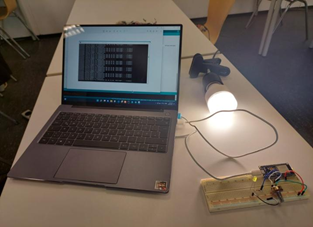
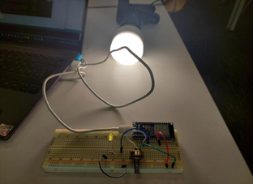
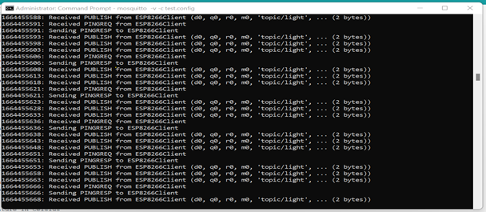

# iot-smart-lighting-control
IoT-based smart lighting control system using ESP8266, MQTT, potentiometer input, and LIFX smart bulb.
# IoT Smart Lighting Control System

This project was developed as a course project during my Master's study.  
The goal was to design a smart lighting control system for home automation, where light intensity can be adjusted based on user preference.

## Project Overview

The system uses a remote control unit with a potentiometer to read the preferred light intensity. The value is sent through MQTT, and the smart bulb intensity is adjusted accordingly.

## Features

- Smart light intensity control
- Potentiometer-based user input
- MQTT-based communication
- ESP8266/Arduino-based remote control unit
- LIFX smart bulb integration
- Hardware prototype and test setup

## System Architecture

## Hardware Components

- Arduino Nano / ESP8266 development board
- LIFX smart bulb
- Potentiometer 100 kΩ
- LEDs
- 220 Ω resistors
- 10 kΩ resistors
- Jumper wires
- Breadboard

## Software and Tools

- Arduino IDE
- MQTT Broker
- VS Code
- Fritzing

## Hardware Setup

## Prototype

## MQTT Interface

## Working Principle

1. The user adjusts the potentiometer.
2. The ESP8266 reads the analog value.
3. The value is published to an MQTT topic.
4. The MQTT broker forwards the message.
5. The smart lighting system adjusts the light intensity.

## Challenges

- Establishing reliable communication with the smart bulb
- Switching from UDP to MQTT due to token and reliability issues
- Controlling light intensity based on user preference
- Building a working hardware prototype

## Project Report

The full project report is available here:

[Project-IoT.pdf](docs/Project-IoT.pdf)

## References

- LIFX API documentation
- Mosquitto MQTT broker
- Fritzing
